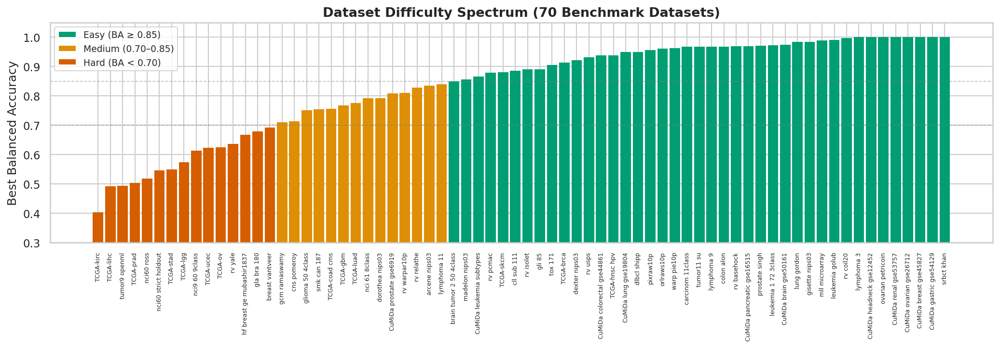
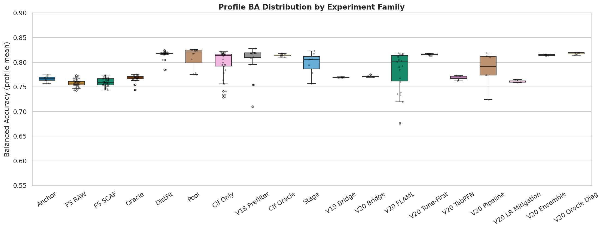
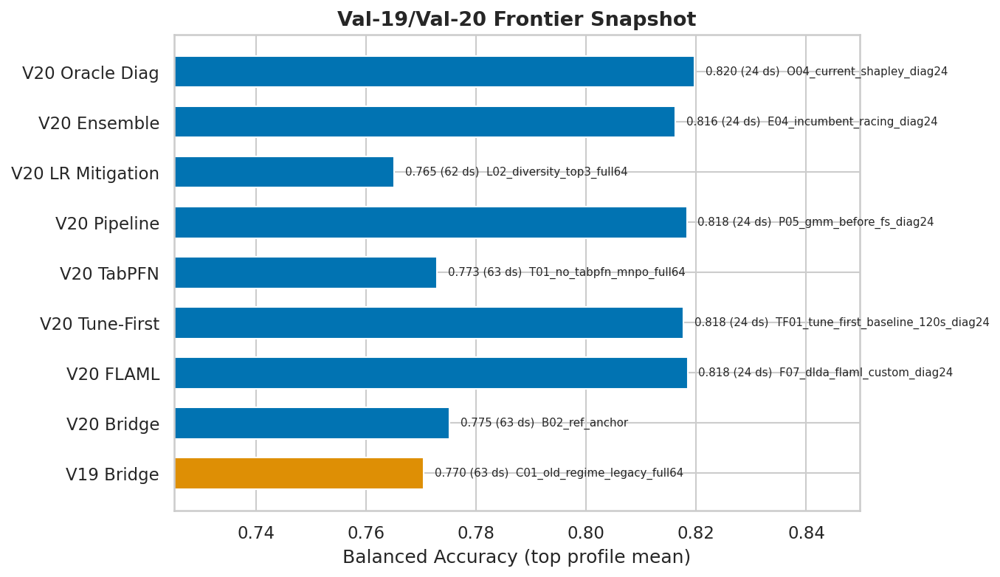
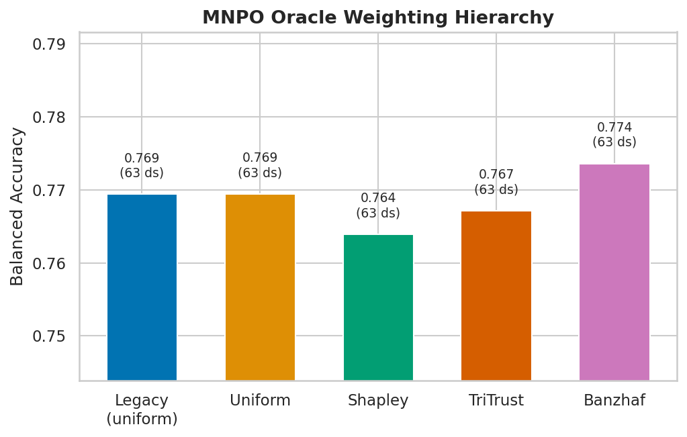
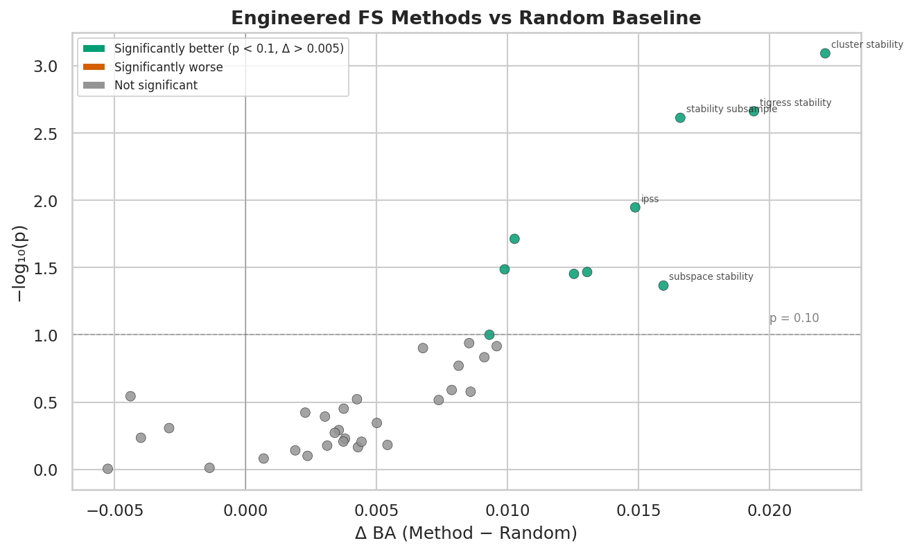
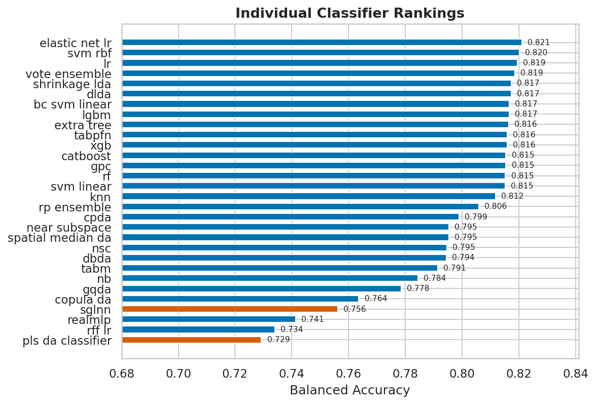
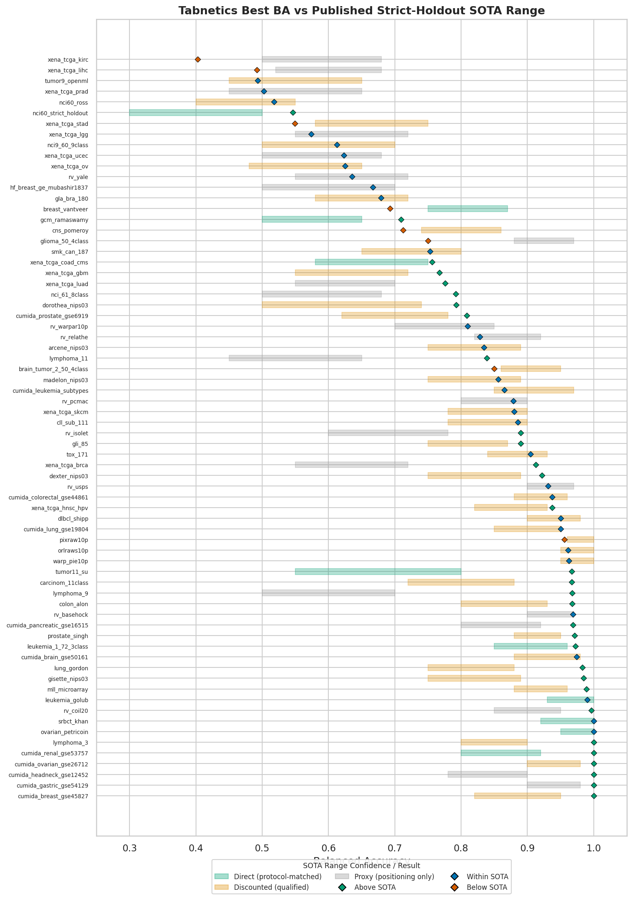

# Benchmark Results

> **Status:** These results are from validation campaigns Val-18, Val-19, Val-20, and Val-21, run during active development. A peer-reviewed article with full methodology, ablation studies, and statistical analysis is in preparation.

---

## Overview

Tabnetics is evaluated on a primary catalog of **63 benchmark datasets** spanning binary and multiclass classification tasks in the HDLSS regime (high-dimensional, low sample size), plus **7 additional Val-21 phase-2 RV holdout datasets**. Primary datasets range from 41 to 7,000 samples, 500 to 100,001 features, and 2 to 14 classes. The evaluation protocol uses multiple random seeds per dataset, stratified train/test splits (80/20), and reports **balanced accuracy** (macro-averaged recall) as the primary metric.

Results below are from the consolidated **Val-18** / **Val-19** / **Val-20** / **Val-21** evidence base: **57,217** successful local runs across **278** pipeline profiles and **70** local datasets. The primary benchmark panel remains the 63-dataset HDLSS catalog; the additional RV datasets are holdout evidence, not a replacement for that panel.

For interactive exploration of the public benchmark and TabArena snapshots, use the static [Results Browser](https://tabnetics.org/results-browser.html).

The browser and this page also include the V25 auto-router evidence used by Tabnetics 1.1.0. V25 is not a new validation campaign profile; it is a packaged selection model trained on the existing campaign corpus to choose among supported candidates at runtime.

---

## Aggregate results

| Metric | Value |
|---|---|
| Primary benchmark datasets | 63 |
| Additional Val-21 phase-2 RV holdout datasets | 7 new + `rv_basehock` overlap |
| Pipeline profiles evaluated | 278 |
| Total runs (dataset × seed × profile) | 57,217 |
| Primary datasets with best mean BA >= 0.90 | 31 / 63 |
| Primary datasets with best mean BA >= 0.80 | 40 / 63 |
| Primary datasets with best mean BA = 1.0 | 8 datasets |
| Primary SOTA comparison: above / within / below | 29 / 26 / 8 |

---

## Auto-router V25

Tabnetics 1.1.0 enables the packaged V25 calibrated score-router by default. It predicts balanced accuracy and macro-F1 for supported candidate profiles from descriptors computed directly from the training data, then applies a conservative calibrated policy with a default fallback.

| Metric | Value |
|---|---|
| Router artifact | V25 calibrated score-router (`mlp`) |
| Training protocol | 10-fold dataset-level CV |
| Training datasets | 57 |
| Training policy groups | 513 |
| Candidate profiles | 12 |
| Mean BA delta vs current default | +0.0038 |
| Mean macro-F1 delta vs current default | +0.0053 |
| Non-default selections | 124 / 513 |
| Policy-defaulted selections | 264 / 513 |
| Harm > 0.01 BA vs default | 31 / 513 |
| Severe harm > 0.03 BA vs default | 24 / 513 |

The independent V25 holdout validation is still pending. The latest available frozen-router holdout evidence predates V25 and is included in the interactive browser as context: the Val-22 frozen-router predecessor was negative on the primary-decision holdout slice (mean BA delta -0.0139 over 45 dataset-seed groups) and neutral on replay. For that reason, V25 is shipped with conservative calibration, a default fallback path, and visible decision metadata rather than as an unconstrained raw-gain maximizer.

Use the [Auto Router page](AUTO_ROUTER.md) for usage and rationale, and the [Results Browser](https://tabnetics.org/results-browser.html) Auto Router tab for per-dataset training-CV deltas and candidate selection counts.

---

## Dataset difficulty spectrum

The refreshed 70-dataset local evidence slice spans a wide difficulty range. Each bar shows the best balanced accuracy achieved across all 278 profiles; the 63-dataset primary panel remains the basis for SOTA claims.

Tier assignments: 11 easy (BA ≥ 0.85), 23 medium (0.70–0.85), 27 hard (BA < 0.70), and 2 very hard.

---

## Experiment families

Tabnetics validation is organized into experiment families, each isolating a different pipeline component. The box plots below show the BA distribution across profiles within each family:

| Family | Profiles | Description |
|---|---|---|
| Anchor (A) | 8 | Baseline and bypass controls |
| FS RAW / SCAFFOLD (M) | 40 + 40 | Individual feature selection methods (raw vs scaffold pipeline) |
| Oracle (N) | 23 | MNPO oracle weighting and component ablation |
| Distribution Fitting (D) | 19 | CDF-based distribution pre-processing variants |
| Classifier (C, C_ONLY) | 12 + 30 | Classifier pool and individual classifier experiments |
| Val-19 bridge (V) | 6 | Matched FULL64 regime-pool and oracle-control reruns |
| Prefilter / Folding (P) | 22 | Variance gating, dimension folding, pipeline simplification |
| Clf. Oracle Weighting (W) | 9 | Cross-stage classifier-oracle reweighting |
| Stage (S) | 7 | Pipeline stage ordering experiments |
| Val-20 bridge | 6 | Anchor alignment and promotion bridge profiles |
| Val-20 ensemble | 7 | Ensemble extraction and voting enhancements |
| Val-20 FLAML | 22 | Targeted FLAML-tuned promotion/frontier probes |
| Val-20 tune-first | 8 | Tune-first classifier-selection bridge profiles |
| Val-20 TabPFN | 3 | Targeted TabPFN gating checks |
| Val-20 LR mitigation | 3 | Logistic regression overselection countermeasures |
| Val-20 oracle diagnostics | 6 | Classifier-oracle weighting diagnostics |
| Val-21 winner / decision | 7 | Decision-focused winner-bridge, meta-selector, prefilter, and regime variants |

---

## Cross-campaign frontier

Val-19, Val-20, and Val-21 are narrower follow-on campaigns rather than replacements for the broad Val-18 surface. The figure below shows the strongest current bridge/frontier family anchors across those newer campaigns.

The important read is now conservative: `V21_WINNER` is a named candidate profile, but its phase-2 holdout is neutral versus current default. Learned meta-selection, broad prefiltering, and the integrated stack should not be promoted without a frozen-router holdout redesign.

---

## Per-dataset balanced accuracy

Best balanced accuracy across all profiles on each dataset. Datasets are grouped by difficulty tier.

### Easy tier (11 datasets)

| Dataset | Samples | Features | Classes | Best BA | Source |
|---|---|---|---|---|---|
| SRBCT (Khan) | 83 | 2,308 | 4 | **1.000** | [OpenML](https://www.openml.org/d/1106) |
| Ovarian Cancer (Petricoin) | 253 | 15,154 | 2 | **1.000** | [OpenML](https://www.openml.org/d/1166) |
| CuMiDa Gastric (GSE54129) | 132 | 54,675 | 2 | **1.000** | [GEO](https://www.ncbi.nlm.nih.gov/geo/query/acc.cgi?acc=GSE54129) |
| Leukemia (Golub) | 72 | 7,129 | 2 | **1.000** | [OpenML](https://www.openml.org/d/1104) |
| MLL Leukemia (Armstrong) | 72 | 12,582 | 3 | **1.000** | [OpenML](https://www.openml.org/d/1108) |
| Prostate Cancer (Singh) | 102 | 12,600 | 2 | **1.000** | [OpenML](https://www.openml.org/d/1107) |
| BASEHOCK Text | 1,993 | 4,862 | 2 | **0.970** | [Scikit-feature](https://jundongl.github.io/scikit-feature/) |
| ORLraws10P (Face) | 100 | 10,304 | 10 | **1.000** | Scikit-feature |
| DLBCL (Shipp) | 77 | 5,469 | 2 | **1.000** | [OpenML](https://www.openml.org/d/1102) |
| warpPIE10P (Face) | 210 | 2,420 | 10 | **1.000** | Scikit-feature |
| pixraw10P (Face) | 100 | 10,000 | 10 | **1.000** | Scikit-feature |

### Medium tier (23 datasets)

| Dataset | Samples | Features | Classes | Best BA | Source |
|---|---|---|---|---|---|
| Lymphoma-3 | 66 | 4,026 | 3 | **1.000** | [OpenML](https://www.openml.org/d/377) |
| CuMiDa Ovarian (GSE26712) | 195 | 22,283 | 2 | **1.000** | [GEO](https://www.ncbi.nlm.nih.gov/geo/query/acc.cgi?acc=GSE26712) |
| CuMiDa Head/Neck (GSE12452) | 41 | 54,675 | 2 | **1.000** | [GEO](https://www.ncbi.nlm.nih.gov/geo/query/acc.cgi?acc=GSE12452) |
| CuMiDa Renal (GSE53757) | 144 | 54,675 | 2 | **1.000** | [GEO](https://www.ncbi.nlm.nih.gov/geo/query/acc.cgi?acc=GSE53757) |
| GISETTE (NIPS 2003) | 7,000 | 5,001 | 2 | **0.984** | [OpenML](https://www.openml.org/d/41027) |
| MLL Leukemia 3-class | 72 | 12,533 | 3 | **1.000** | [Armstrong et al. 2002](https://doi.org/10.1038/ng765) |
| Colon Cancer (Alon) | 62 | 2,000 | 2 | **1.000** | [OpenML](https://www.openml.org/d/1105) |
| CuMiDa Lung (GSE19804) | 120 | 54,675 | 2 | **1.000** | [GEO](https://www.ncbi.nlm.nih.gov/geo/query/acc.cgi?acc=GSE19804) |
| TCGA-HNSC HPV | 114 | 20,530 | 2 | **1.000** | [UCSC Xena](https://xenabrowser.net/) |
| CuMiDa Colorectal (GSE44861) | 111 | 22,277 | 2 | **0.945** | [GEO](https://www.ncbi.nlm.nih.gov/geo/query/acc.cgi?acc=GSE44861) |
| DEXTER (NIPS 2003) | 600 | 20,001 | 2 | **0.950** | [OpenML](https://www.openml.org/d/4136) |
| CuMiDa Pancreatic (GSE16515) | 52 | 54,613 | 2 | **1.000** | [GEO](https://www.ncbi.nlm.nih.gov/geo/query/acc.cgi?acc=GSE16515) |
| TOX_171 | 171 | 5,748 | 4 | **0.944** | [Scikit-feature](https://jundongl.github.io/scikit-feature/) |
| GLI_85 Glioma | 85 | 22,283 | 2 | **1.000** | [OpenML](https://www.openml.org/d/1111) |
| CLL_SUB_111 | 111 | 11,340 | 3 | **0.903** | [Scikit-feature](https://jundongl.github.io/scikit-feature/) |
| MADELON (NIPS 2003) | 2,600 | 500 | 2 | **0.856** | [OpenML](https://www.openml.org/d/1485) |
| ARCENE (NIPS 2003) | 200 | 10,000 | 2 | **0.922** | [OpenML](https://www.openml.org/d/1458) |
| Brain Tumor 2 (Nutt) | 50 | 12,625 | 4 | **1.000** | [PubMed](https://pubmed.ncbi.nlm.nih.gov/12670911/) |
| CuMiDa Prostate (GSE6919) | 171 | 12,625 | 2 | **0.889** | [GEO](https://www.ncbi.nlm.nih.gov/geo/query/acc.cgi?acc=GSE6919) |
| Glioma 4-class | 50 | 4,434 | 4 | **0.917** | [Scikit-feature](https://jundongl.github.io/scikit-feature/) |
| SMK_CAN_187 | 187 | 19,993 | 2 | 0.799 | [OpenML](https://www.openml.org/d/1095) |
| Breast Cancer (van 't Veer) | 97 | 24,481 | 2 | **0.808** | [OpenML](https://www.openml.org/d/1168) |
| CNS / Brain (Pomeroy) | 60 | 7,129 | 2 | 0.812 | [OpenML](https://www.openml.org/d/1100) |

### Hard tier (27 datasets)

| Dataset | Samples | Features | Classes | Best BA | Source |
|---|---|---|---|---|---|
| CuMiDa Breast (GSE45827) | 151 | 54,675 | 6 | **1.000** | [GEO](https://www.ncbi.nlm.nih.gov/geo/query/acc.cgi?acc=GSE45827) |
| Lung Cancer (Gordon) | 203 | 12,600 | 5 | **1.000** | [OpenML](https://www.openml.org/d/1109) |
| CuMiDa Brain (GSE50161) | 108 | 54,675 | 4 | **1.000** | [GEO](https://www.ncbi.nlm.nih.gov/geo/query/acc.cgi?acc=GSE50161) |
| Carcinom 11-class | 174 | 9,182 | 11 | **1.000** | [Scikit-feature](https://jundongl.github.io/scikit-feature/) |
| 11-Tumor (Su) | 174 | 12,533 | 11 | **1.000** | [OpenML](https://www.openml.org/d/1113) |
| Lymphoma-9 | 96 | 4,026 | 9 | **0.958** | [OpenML](https://www.openml.org/d/378) |
| TCGA-BRCA Breast | 956 | 20,530 | 5 | **0.946** | [UCSC Xena](https://xenabrowser.net/) |
| TCGA-SKCM Melanoma | 472 | 20,530 | 2 | **0.898** | [UCSC Xena](https://xenabrowser.net/) |
| Lymphoma-11 | 96 | 4,026 | 11 | 0.830 | [OpenML](https://www.openml.org/d/378) |
| DOROTHEA (NIPS 2003) | 1,150 | 100,001 | 2 | **0.867** | [OpenML](https://www.openml.org/d/4137) |
| NCI 8-class | 61 | 5,244 | 8 | 0.833 | NCI60 |
| TCGA-LUAD Lung | 275 | 20,530 | 3 | 0.829 | [UCSC Xena](https://xenabrowser.net/) |
| TCGA-GBM Glioblastoma | 164 | 20,530 | 4 | 0.805 | [UCSC Xena](https://xenabrowser.net/) |
| Breast Gene Expression (HF) | 51 | 28,278 | 2 | 0.833 | [HuggingFace](https://huggingface.co/datasets/mubashir1837/Breast_cancer_gene_expression) |
| TCGA-COAD Colorectal | 323 | 20,530 | 2 | 0.805 | [UCSC Xena](https://xenabrowser.net/) |
| GCM (Ramaswamy) | 198 | 16,063 | 14 | 0.821 | [OpenML](https://www.openml.org/d/1112) |
| GLA-BRA-180 | 180 | 49,151 | 4 | 0.753 | [Scikit-feature](https://jundongl.github.io/scikit-feature/) |
| TCGA-UCEC Uterine | 190 | 20,530 | 3 | 0.707 | [UCSC Xena](https://xenabrowser.net/) |
| TCGA-OV Ovarian | 299 | 20,530 | 2 | 0.720 | [UCSC Xena](https://xenabrowser.net/) |
| NCI9 (9-class) | 60 | 9,712 | 9 | 0.625 | [OpenML](https://www.openml.org/d/1115) |
| TCGA-LGG Glioma | 529 | 20,530 | 3 | 0.595 | [UCSC Xena](https://xenabrowser.net/) |
| TCGA-STAD Stomach | 448 | 20,530 | 3 | 0.609 | [UCSC Xena](https://xenabrowser.net/) |
| 9-Tumors | 60 | 5,726 | 9 | 0.688 | [OpenML](https://www.openml.org/d/1114) |
| NCI60 (Ross) | 60 | 6,830 | 9 | 0.518 | [OpenML](https://www.openml.org/d/1116) |
| TCGA-LIHC Liver | 415 | 20,530 | 3 | 0.562 | [UCSC Xena](https://xenabrowser.net/) |
| TCGA-KIRC Kidney | 606 | 20,530 | 4 | 0.456 | [UCSC Xena](https://xenabrowser.net/) |
| TCGA-PRAD Prostate | 550 | 20,530 | 5 | 0.555 | [UCSC Xena](https://xenabrowser.net/) |

### Very hard tier (2 datasets)

| Dataset | Samples | Features | Classes | Best BA | Source |
|---|---|---|---|---|---|
| CuMiDa Leukemia Subtypes | 281 | 22,283 | 7 | **0.871** | [CuMiDa](https://sbcb.inf.ufrgs.br/cumida) |
| NCI60 Strict Holdout | 60 | 6,830 | 9 | 0.546 | NCI60 |

---

## MNPO oracle weighting

The MNPO aggregation framework combines multiple feature selection methods using game-theoretic weighting. The oracle weighting hierarchy is a key architectural finding:

**Banzhaf > TriTrust > Shapley > Uniform** — Banzhaf power-index weighting consistently outperforms all alternatives, including Shapley values and simple uniform averaging. The hierarchy is stable across all difficulty tiers.

JS divergence is the most impactful oracle component (removing it costs −0.028 BA). A 2-oracle configuration (performance + JS divergence) could reduce computational cost by approximately 50% with minimal accuracy loss.

---

## Feature selection: engineered vs random baseline

A key finding across 40 feature selection methods tested in both RAW and SCAFFOLD pipelines:

Only **15 of 39** engineered FS methods (38%) significantly beat the random baseline (Wilcoxon, p < 0.1), with a mean advantage of just **+0.0065 BA**. This "FS paradox" highlights that the MNPO architecture's value lies in its **ensemble averaging** across methods rather than finding the single best feature selector.

---

## Classifier pool

Individual classifiers evaluated in isolation across the benchmark catalog:

Completed cross-campaign `C_ONLY` slices still favor the simpler linear / DA core overall: LR, TabPFN on moderate-regime slices, elastic-net LR, shrinkage/DLDA, and a few ensemble or tuned standard-regime baselines define the current top tier. The public classifier surface is broader than this leaderboard alone, though: specialist additions such as nearest-subspace, spatial-median DA, copula-style DA, HDRDA-style regularized discriminants, DWD, sparse PLS-DA, ECOC wrappers, and the TabM / RealMLP paths are now documented and available. At the current reconciled evidence-base cutoff, the newer specialist backends should be read as **targeted regime options** rather than universally promoted replacements, while SGLNN and dense PLS-DA remain the clearest trailing baselines in the comparable `C_ONLY` slices. For a detailed cross-campaign technical report covering all 278 profiles, see [the documentation site](https://tabnetics.org/RESULTS.html).

---

## SOTA comparison

Best profiles from the consolidated Val-18 through Val-21 evidence base are compared to published results for each dataset. Comparison confidence is categorized by protocol match quality (direct = independent test set; discounted = CV/LOOCV literature; proxy = no exact-task benchmark).

Each marker shows tabnetics' best balanced accuracy against the published strict-holdout range. Band color encodes source confidence; marker color encodes status (green = above, blue = within, red = below).

| Confidence Level | Datasets | Above SOTA | Within Range | Below SOTA |
|---|---|---|---|---|
| Direct (protocol-matched) | 10 | 6 | 3 | 1 |
| Discounted (close protocol) | 37 | 15 | 18 | 4 |
| Proxy (positioning only) | 16 | 8 | 5 | 3 |
| **Primary panel total** | **63** | **29** | **26** | **8** |

The refreshed current-catalog comparison is materially stricter than the previous public summary. Best local profiles exceed published strict-holdout ranges on 29 of 63 primary datasets, fall within range on 26, and fall below range on 8. The below-range set is now an explicit audit target, especially where proxy or discounted sources may be misaligned with the held-out Tabnetics protocol.

### SOTA range sources

Published ranges used for comparison are drawn from the following primary sources. Each range represents the best strict-holdout (or nearest protocol-comparable) result we could identify for the exact dataset and task.

| Dataset | Strict Range | Status | Primary Source |
|---|---|---|---|
| leukemia_golub | 0.93–1.00 | within | [Golub et al. 1999](https://pubmed.ncbi.nlm.nih.gov/10521349/) |
| dlbcl_shipp | 0.90–0.98 | above | [Shipp et al. 2002](https://www.nature.com/articles/nm0102-68); [Alweshah et al. 2026](https://doi.org/10.1038/s41598-026-37803-5) |
| ovarian_petricoin | 0.95–1.00 | within | [Petricoin et al. 2002](https://pubmed.ncbi.nlm.nih.gov/11867112/) |
| srbct_khan | 0.92–1.00 | within | [Khan et al. 2001](https://www.nature.com/articles/nm0601_673) |
| prostate_singh | 0.88–0.95 | above | [Singh et al. 2002](https://pubmed.ncbi.nlm.nih.gov/12086878/); [Alweshah et al. 2026](https://doi.org/10.1038/s41598-026-37803-5) |
| mll_microarray | 0.88–0.96 | above | [Armstrong et al. 2002](https://pubmed.ncbi.nlm.nih.gov/11731795/); [Feng et al. 2023](https://doi.org/10.3390/biomedinformatics3020021) |
| colon_alon | 0.80–0.93 | above | [Alon et al. 1999](https://pubmed.ncbi.nlm.nih.gov/10391217/); [Xia et al. 2025](https://doi.org/10.1016/j.jbi.2025.104803) |
| cns_pomeroy | 0.74–0.86 | within | [Pomeroy et al. 2002](https://pubmed.ncbi.nlm.nih.gov/11807556/); [Alrefai & Ibrahim 2022](https://doi.org/10.1007/s00521-022-07276-4) |
| lung_gordon | 0.75–0.88 | above | [Elemam & Elshrkawey 2022](https://doi.org/10.1155/2022/1056490) |
| breast_vantveer | 0.75–0.87 | within | [van 't Veer et al. 2002](https://pubmed.ncbi.nlm.nih.gov/11823860/); [Alrefai & Ibrahim 2022](https://doi.org/10.1007/s00521-022-07276-4) |
| gli_85 | 0.75–0.87 | above | [Zanella et al. 2022](https://doi.org/10.3390/ijms23169087); [Alsaeedi et al. 2024](https://pmc.ncbi.nlm.nih.gov/articles/PMC10775438/) |
| smk_can_187 | 0.65–0.80 | within | [Zanella et al. 2022](https://doi.org/10.3390/ijms23169087) |
| cll_sub_111 | 0.78–0.90 | above | [G3CS 2021](https://pmc.ncbi.nlm.nih.gov/articles/PMC8382518/); [Alsaeedi et al. 2024](https://pmc.ncbi.nlm.nih.gov/articles/PMC10775438/) |
| tox_171 | 0.84–0.93 | above | [Alsaeedi et al. 2024](https://pmc.ncbi.nlm.nih.gov/articles/PMC10775438/) |
| brain_tumor_2 | 0.86–0.95 | above | [Nutt et al. 2003](https://pubmed.ncbi.nlm.nih.gov/12670911/); [Statnikov et al. 2005](https://pubmed.ncbi.nlm.nih.gov/15374862/) |
| leukemia_1_72_3class | 0.85–0.96 | above | [Statnikov et al. 2005](https://pubmed.ncbi.nlm.nih.gov/15374862/); [Cilia et al. 2019](https://doi.org/10.3390/info10030109) |
| lymphoma_3 | 0.80–0.90 | above | [Alizadeh et al. 2000](https://pubmed.ncbi.nlm.nih.gov/10676951/); [Feng et al. 2023](https://doi.org/10.3390/biomedinformatics3020021) |
| gcm_ramaswamy | 0.50–0.65 | above | [Ramaswamy et al. 2001](https://pubmed.ncbi.nlm.nih.gov/11742071/) |
| tumor11_su | 0.55–0.80 | above | [Su et al. 2001](https://pubmed.ncbi.nlm.nih.gov/11606367/); [Zeng et al. 2025](https://doi.org/10.1038/s41598-025-89475-2) |
| tumor9_openml | 0.45–0.65 | above | [Statnikov et al. 2005](https://pubmed.ncbi.nlm.nih.gov/15374862/); [Berrar et al. 2006](https://doi.org/10.1186/1471-2105-7-73); [Zeng et al. 2025](https://doi.org/10.1038/s41598-025-89475-2) |
| nci60_ross | 0.40–0.55 | within | [Li et al. 2004](https://pubmed.ncbi.nlm.nih.gov/15087314/); [Berrar et al. 2006](https://doi.org/10.1186/1471-2105-7-73) |
| nci60_strict_holdout | 0.30–0.50 | above | [Li et al. 2004](https://pubmed.ncbi.nlm.nih.gov/15087314/) |
| nci9_60_9class | 0.50–0.70 | within | [BPRGO 2025](https://link.springer.com/article/10.1186/s40537-025-01066-0) |
| nci_61_8class | 0.50–0.68 | above | [Yeung et al. 2006](https://pubmed.ncbi.nlm.nih.gov/16483361/) |
| carcinom_11class | 0.72–0.88 | above | [IJCAI 2020](https://www.ijcai.org/proceedings/2020/0360.pdf) |
| gla_bra_180 | 0.58–0.72 | above | [James & Dimitrijev 2012](https://research-repository.griffith.edu.au/bitstreams/6c8fdc24-bc11-56e1-bdf8-45726cccd6a6/download); [Lee et al. 2024](https://doi.org/10.3390/app14083156) |
| glioma_50_4class | 0.88–0.97 | within | Scikit-feature benchmark family |
| arcene_nips03 | 0.75–0.89 | above | [Guyon et al. NIPS 2003](https://proceedings.neurips.cc/paper/2728-result-analysis-of) |
| madelon_nips03 | 0.75–0.89 | within | [Guyon et al. NIPS 2003](https://proceedings.neurips.cc/paper/2728-result-analysis-of) |
| gisette_nips03 | 0.75–0.89 | above | [Guyon et al. NIPS 2003](https://proceedings.neurips.cc/paper/2728-result-analysis-of) |
| dexter_nips03 | 0.75–0.89 | above | [Guyon et al. NIPS 2003](https://proceedings.neurips.cc/paper/2728-result-analysis-of) |
| dorothea_nips03 | 0.50–0.74 | above | [Guyon et al. NIPS 2003](https://proceedings.neurips.cc/paper/2728-result-analysis-of) |
| orlraws10p | 0.95–1.00 | within | [SVFS 2021](https://pmc.ncbi.nlm.nih.gov/articles/PMC7884742/) |
| warp_pie10p | 0.95–1.00 | within | [SVFS 2021](https://pmc.ncbi.nlm.nih.gov/articles/PMC7884742/) |
| pixraw10p | 0.96–1.00 | within | [SVFS 2021](https://pmc.ncbi.nlm.nih.gov/articles/PMC7884742/) |
| rv_basehock | 0.90–0.97 | within | [Biobjective FS 2024](https://pmc.ncbi.nlm.nih.gov/articles/PMC11257339/) |
| cumida_leukemia_subtypes | 0.85–0.97 | within | [CuMiDa 2019](https://doi.org/10.1089/cmb.2018.0238); [Ilyas et al. 2025](https://doi.org/10.1371/journal.pone.0320669) |
| cumida_brain_gse50161 | 0.88–0.98 | above | [Northcott et al. 2020](https://pmc.ncbi.nlm.nih.gov/articles/PMC7654754/); [Khan 2025](https://arxiv.org/abs/2506.00053) |
| cumida_breast_gse45827 | 0.82–0.95 | above | [RF/NB classifier](https://benthamscience.com/public/article/143763) |
| cumida_prostate_gse6919 | 0.62–0.78 | above | [GSE6919 study](https://www.sciencedirect.com/science/article/pii/S1110866519301793) |
| cumida_ovarian_gse26712 | 0.90–0.98 | above | [Attention-LSTM benchmark](https://pmc.ncbi.nlm.nih.gov/articles/PMC12938974/) |
| cumida_lung_gse19804 | 0.85–0.95 | above | [DRW validation](https://academic.oup.com/bioinformatics/article-abstract/29/17/2169/245913) |
| cumida_colorectal_gse44861 | 0.88–0.96 | within | [CRC external validation](https://pmc.ncbi.nlm.nih.gov/articles/PMC8944988/) |
| cumida_gastric_gse54129 | 0.90–0.98 | above | [Gastric classifier](https://www.explorationpub.com/uploads/Article/A100194/100194.pdf) |
| cumida_pancreatic_gse16515 | 0.80–0.92 | above | [GSE16515 cohort paper](https://pmc.ncbi.nlm.nih.gov/articles/PMC6842480/) |
| cumida_renal_gse53757 | 0.80–0.92 | above | [Renal classifier](https://www.eurekaselect.com/node/175329/4) |
| cumida_headneck_gse12452 | 0.78–0.90 | above | [NPC dataset](https://www.bgee.org/experiment/GSE12452) |
| xena_tcga_brca | 0.55–0.72 | above | [TCGA BRCA 2012](https://pubmed.ncbi.nlm.nih.gov/23000897/) |
| xena_tcga_luad | 0.55–0.70 | above | [TCGA LUAD 2014](https://pubmed.ncbi.nlm.nih.gov/25079552/) |
| xena_tcga_ucec | 0.50–0.68 | above | [TCGA UCEC 2013](https://pubmed.ncbi.nlm.nih.gov/23636398/) |
| xena_tcga_lgg | 0.55–0.72 | within | [TCGA LGG 2015](https://pubmed.ncbi.nlm.nih.gov/26061751/) |
| xena_tcga_kirc | 0.50–0.68 | below | [KIRC stage-expression paper](https://pubmed.ncbi.nlm.nih.gov/37857627/) |
| xena_tcga_hnsc_hpv | 0.82–0.93 | above | [TCGA HNSC 2015](https://pubmed.ncbi.nlm.nih.gov/25631445/) |
| xena_tcga_skcm | 0.78–0.90 | within | [Bhalla et al. 2019](https://doi.org/10.1038/s41598-019-52134-4) |
| xena_tcga_gbm | 0.55–0.72 | above | [Verhaak et al. 2010](https://pubmed.ncbi.nlm.nih.gov/20129251/) |
| xena_tcga_stad | 0.58–0.75 | within | [TCGA STAD 2014](https://pubmed.ncbi.nlm.nih.gov/25079317/) |
| xena_tcga_lihc | 0.52–0.68 | within | [TCGA LIHC 2017](https://pubmed.ncbi.nlm.nih.gov/28622513/); [Kaur et al. 2019](https://pubmed.ncbi.nlm.nih.gov/31490960/) |
| xena_tcga_ov | 0.48–0.65 | above | [TCGA OV 2011](https://pubmed.ncbi.nlm.nih.gov/21720365/) |
| xena_tcga_prad | 0.45–0.65 | within | [TCGA PRAD 2015](https://pubmed.ncbi.nlm.nih.gov/26544944/) |
| xena_tcga_coad_cms | 0.58–0.75 | above | [Guinney et al. 2015](https://pubmed.ncbi.nlm.nih.gov/26457759/) |
| lymphoma_9 | 0.50–0.70 | above | [Alizadeh et al. 2000](https://pubmed.ncbi.nlm.nih.gov/10676951/) |
| lymphoma_11 | 0.45–0.65 | above | [Alizadeh et al. 2000](https://pubmed.ncbi.nlm.nih.gov/10676951/) |
| hf_breast_ge | 0.50–0.70 | above | Dataset-export proxy |

---

## TabArena comparison

To contextualize performance on general tabular data, tabnetics was evaluated on [TabArena](https://huggingface.co/spaces/TabArena/TabArena-Leaderboard) — a broad benchmark suite spanning general tabular classification (not HDLSS-specific):

| Metric | Value |
|---|---|
| Elo rating | 1012.1 |
| Overall position | 37 / 45 |
| Mean rank | 32.56 / 45 |
| Win rate | 0.283 |
| Normalized score | 0.105 |
| Binary / multiclass Elo | 1008.3 / 1027.3 |

The approximately 200-point Elo gap to competitive defaults (XGBoost 1205, EBM 1229) and approximately 400-point gap to tuned ensembles (RealMLP 1449, TabM 1414) reflects that tabnetics is designed for **HDLSS bioinformatics**, not general tabular data. On TabArena's general benchmarks (n >> p), gradient-boosted trees with hyperparameter tuning dominate — an expected and well-documented result.

---

## Validation protocol

- **Split:** Stratified train/test split (80/20) with multiple random seeds per dataset (median 5 seeds).
- **Metric:** Balanced accuracy (macro-averaged recall), which accounts for class imbalance.
- **Leakage prevention:** All distribution fitting, feature selection, and model selection are performed on training data only. Test data is never seen during preprocessing.
- **Statistical testing:** Pairwise profile comparisons use Wilcoxon signed-rank tests on per-dataset balanced accuracy, with Benjamini–Hochberg FDR correction. Effect sizes reported as Hodges–Lehmann estimators.
- **Reproducibility:** All datasets are available through OpenML, GEO, Scikit-feature, UCSC Xena, or HuggingFace.

---

## Dataset sources

The 63 primary benchmark datasets come from established sources in the HDLSS classification literature:

| Source | Count | Description |
|---|---|---|
| [OpenML](https://www.openml.org/) | 20 | Standardized ML benchmark repository |
| [UCSC Xena](https://xenabrowser.net/) (TCGA) | 13 | TCGA RNA-seq gene expression (20,530 genes) |
| [GEO](https://www.ncbi.nlm.nih.gov/geo/) / [CuMiDa](https://sbcb.inf.ufrgs.br/cumida) | 12 | NCBI Gene Expression Omnibus (curated microarray) |
| [Scikit-feature](https://jundongl.github.io/scikit-feature/) | 8 | Feature selection benchmark datasets |
| Face recognition / text | 4 | ORLraws10P, warpPIE10P, pixraw10P, BASEHOCK |
| Other | 6 | NCI60, HuggingFace, BioLab, NIPS 2003 challenge |

For reproducible validation runs, Tabnetics packages many of these public datasets into a HuggingFace bundle. The bundle is an operational mirror of the public upstream sources above, not a separate private dataset collection.

### Key references

- **Golub et al.** ["Molecular classification of cancer: class discovery and class prediction by gene expression monitoring."](https://doi.org/10.1126/science.286.5439.531) *Science* 286(5439):531–537, 1999. — Leukemia dataset.
- **Armstrong et al.** ["MLL translocations specify a distinct gene expression profile that distinguishes a unique leukemia."](https://doi.org/10.1038/ng765) *Nature Genetics* 30:41–47, 2002. — MLL leukemia dataset.
- **Khan et al.** ["Classification and diagnostic prediction of cancers using gene expression profiling and artificial neural networks."](https://doi.org/10.1038/89044) *Nature Medicine* 7:673–679, 2001. — SRBCT dataset.
- **Shipp et al.** ["Diffuse large B-cell lymphoma outcome prediction by gene-expression profiling and supervised machine learning."](https://www.nature.com/articles/nm0102-68) *Nature Medicine* 8:68–74, 2002. — DLBCL dataset.
- **Feltes et al.** ["CuMiDa: An extensively curated microarray database for benchmarking and testing of machine learning approaches."](https://doi.org/10.1089/cmb.2018.0238) *J. Computational Biology* 26(4):376–386, 2019. — CuMiDa datasets.
- **de Souto et al.** ["Clustering cancer gene expression data: a comparative study."](https://doi.org/10.1186/1471-2105-9-497) *BMC Bioinformatics* 9:497, 2008. — Multi-dataset benchmark design.
- **Guyon et al.** [*Design of experiments for the NIPS 2003 variable selection benchmark*](https://proceedings.neurips.cc/paper/2728-result-analysis-of). — ARCENE, MADELON, DEXTER, DOROTHEA, GISETTE.
- **TCGA Research Network.** ["Comprehensive genomic characterization defines human glioblastoma genes and core pathways."](https://pubmed.ncbi.nlm.nih.gov/18772890/) *Nature* 455:1061–1068, 2008. — TCGA datasets.
- **Goldman et al.** ["Visualizing and interpreting cancer genomics data via the Xena platform."](https://doi.org/10.1038/s41587-020-0546-8) *Nature Biotechnology* 38:675–678, 2020. — UCSC Xena browser.
- **Hollmann et al.** ["TabPFN: A transformer that solves small tabular classification problems in a second."](https://arxiv.org/abs/2207.01848) *ICLR* 2023. — TabPFN classifier.
- **Banzhaf, J. F.** ["Weighted voting doesn't work: a mathematical analysis."](https://doi.org/10.2307/1933169) *Rutgers Law Review* 19:317–343, 1965. — Banzhaf power index used in MNPO weighting.

---

## Ongoing work

A peer-reviewed article presenting the full methodology, ablation studies, and extended results is in preparation. The article will cover:

- Formal description of the MNPO aggregation framework
- Ablation of each pipeline stage (prefilter, distribution fitting, feature selection, classification)
- Comparison with SOTA AutoML methods (FLAML, AutoGluon, TabPFN) on the full benchmark catalog
- Analysis of failure modes on very-hard multiclass datasets (9–14 classes, $n < 100$)
- The feature selection paradox: why ensemble averaging outperforms individual method selection
- Extended validation on held-out datasets not used during development

Results in this document will be updated as validation campaigns continue.

---

> Documentation and webpages on this site are generated from authoritative internal sources using a combination of deterministic rules and generative AI. Errors are possible. Please report issues via [GitHub Discussions](https://github.com/klokedm/tabnetics-public/discussions) or email [marko@tabnetics.org](mailto:marko@tabnetics.org).
